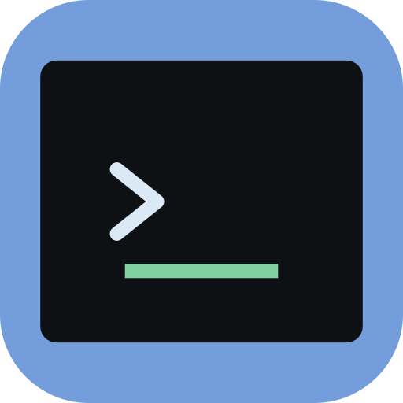

# tmterm



tmterm is a native macOS terminal prototype built with SwiftTerm and tmux.

It runs a private tmux session, renders tmux windows as native tabs, and groups
tabs by their current directory.

## Requirements

- macOS
- tmux

## Development

Development also requires:

- mise
- Swift
- Xcode Command Line Tools

Run the app during development:

```sh
mise run dev
```

Build the debug executable:

```sh
mise run build
```

Build a debug app bundle:

```sh
mise run app
```

## Shortcuts

- `Ctrl-W n`: new tab
- `Ctrl-W h` / `Ctrl-W l`: move between directory groups
- `Ctrl-W j` / `Ctrl-W k`: move within a directory group
- `Ctrl-W 0` ... `Ctrl-W 9`: select tmux window by index
